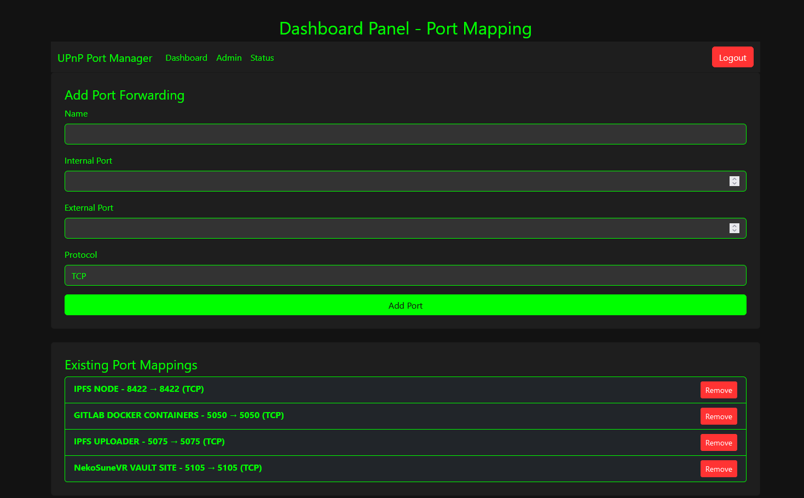
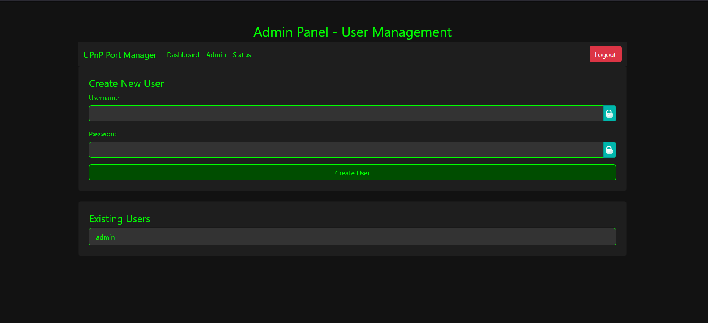
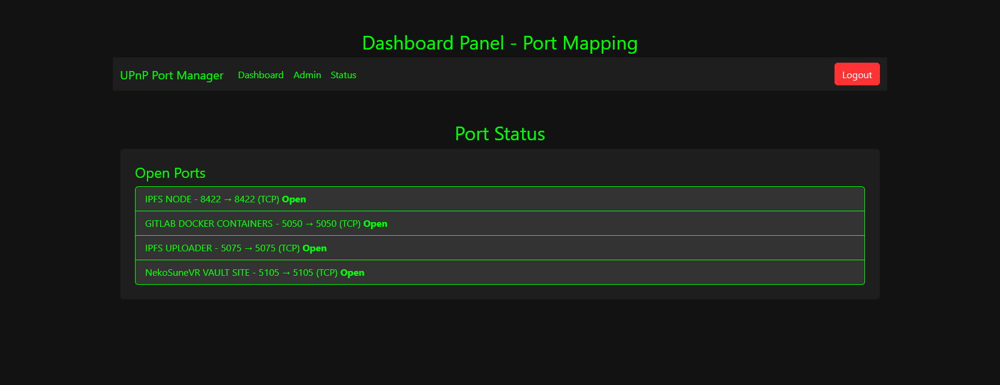
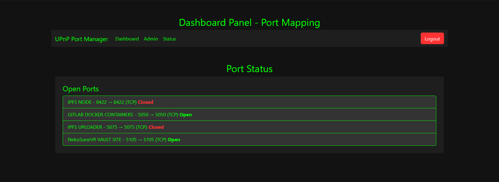

# UPnP Port Mapper

# Introduction

UPnP (Universal Plug and Play) is a set of networking protocols that allow devices to seamlessly discover and interact with each other on a local network. One of its key features is NAT traversal, which enables applications to automatically configure port forwarding on a router without requiring manual intervention.

UPnP Port Mapper is a web-based client that facilitates forwarding ports using UPnP on Linux. It ensures that ports remain open and periodically checks if they are closed, reopening them if necessary. The application also allows users to manage port mappings through a web interface.

# How UPnP Works

Device Discovery: Devices on the network broadcast their presence and capabilities.

Service Advertisement: A UPnP-enabled router announces its support for automatic port forwarding.

Port Mapping Requests: Applications request specific ports to be opened for inbound traffic.

Lease Management: Port mappings have an expiration time and may require renewal to stay active.

This automation eliminates the need for users to manually configure port forwarding in their router settings, making it easier to host services like game servers, remote access tools, and web applications.

Default Login Credentials

Upon installation, the web panel is protected by a login system. The default credentials are:

Username: `admin`

Password: `admin`

Important Security Notice

It is highly recommended to change the default admin password immediately after logging in for the first time to prevent unauthorized access.

To change the password:

Log in using the default credentials.

Navigate to the Admin Settings page.

Enter a new, secure password and save the changes.

# Installation

To install and run UPnP Port Mapper:

# Clone the repository:

```
git clone https://git.nekosunevr.co.uk/nekoprojects/upnpportmapper.git
cd upnpportmapper
```

# Install dependencies:

```
npm install
```

# Start the application:

```
npm start
```

# Access the Web Panel

# Open a browser and navigate to:

```
http://localhost:3000
```

Log in with the default credentials and configure your settings as needed.

# Screenshots

Below are screenshots of the UPnP Port Mapper web panel:










These images provide an overview of the user interface and functionality.

# Features

Automated UPnP port forwarding

Web-based management panel

Persistent port mappings with SQLite storage

Secure login system with bcrypt-encrypted passwords

Admin panel for user management

Dark-themed, mobile-friendly UI

# Contributing

If you'd like to contribute, feel free to submit a pull request or open an issue. Ensure your changes align with the project's goals and coding standards.

# License

This project is licensed under the MIT License. See the `LICENSE` file for details.

For any issues or support requests, please refer to the project's issue tracker or contact the repository maintainer.